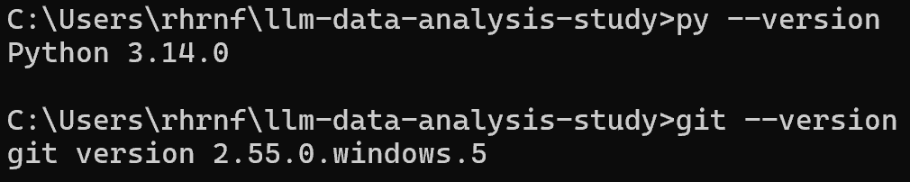
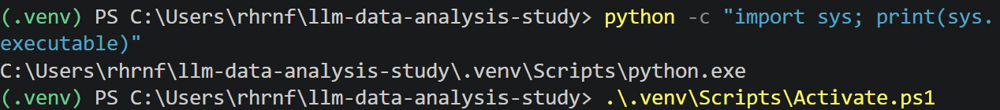
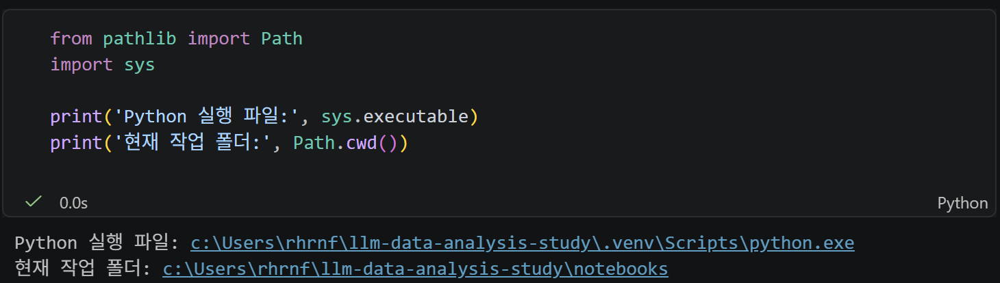
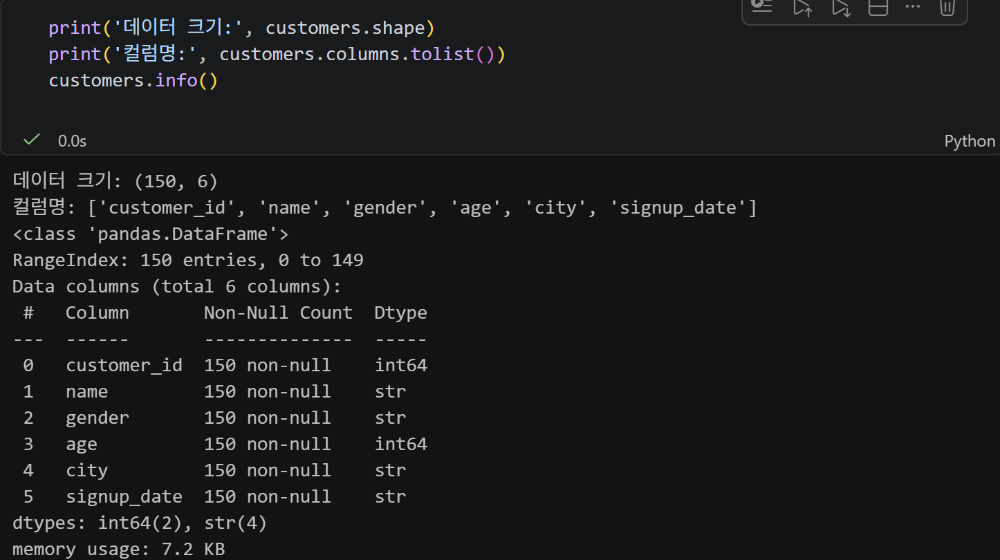

# Chapter 02 제출 답안. VS Code에서 시작하는 데이터 분석 환경

> 최종 파일은 개인 GitHub 저장소의 `chapter02/chapter02.md`로 저장하는 것을 권장합니다.

## 0. 제출 정보

- 이름:진민승
- GitHub ID:Jinminseung
- 개인 저장소: `llm-data-analysis-study`
- 작성일:2026.09.11
- 운영체제:

### 최종 제출 URL

```text
https://github.com/<GitHub-ID>/llm-data-analysis-study/blob/main/chapter02/chapter02.md
```

---

## 1. Python과 Git 환경 확인

### 실행 내용

```text
python --version 또는 py --version
git --version
```

### 실행 결과

```text
C:\Users\rhrnf>py --version
Python 3.14.0
C:\Users\rhrnf>git --version
git version 2.55.0.windows.5
```

### Evidence



### 결과 관찰

python은 3.14.0, git은 2.55.0.windows.5 버전이고 모두 실행 가능하다.

### 나의 해석과 판단

파이썬과 git 모두 실습에 활용 가능하다.

### 업무·분석적 의미

업데이트나 수정된 사항이 있으면 코드 호환에 문제가 발생할 수 있기 때문이다.

### 한계와 추가 확인 사항

실제로 호환상에 문제가 없는지는 코드 작성을 하면서 확인해봐야 한다.

---

## 2. 저장소와 `.venv` 준비

### 수행 내용

- [V] 공식 Public 저장소 clone
- [V] 프로젝트 루트 확인
- [V] `.venv` 생성
- [V] `.venv` 활성화
- [V] `requirements.txt` 설치

### 핵심 실행 결과

```text
현재 프로젝트 경로: C:\Users\rhrnf\llm-data-analysis-study
터미널 Python 실행 파일: C:\Users\rhrnf\llm-data-analysis-study\.venv\Scripts\python.exe 
가상환경 활성화 여부: 활성화됨
패키지 설치 결과: 정상적으로 설치 완료
```

### Evidence



### 결과 관찰

.venv를 가리킨다.

### 나의 해석과 판단

운영체제 고장 및 프로젝트 간 라이브러리 충돌을 방지하기 위해서이다.

### 업무·분석적 의미

모두가 동일한 버전의 파이썬 및 라이브러리를 활용 가능하다.

### 한계와 추가 확인 사항

Python 3.14.0 버전을 사용한다.

---

## 3. VS Code 인터프리터와 Jupyter 커널 연결

### 확인 결과

```text
VS Code Python 인터프리터: .venv(3.14.0.final.0)(Python 3.14.0)
Notebook sys.executable: c:\Users\rhrnf\llm-data-analysis-study\.venv\Scripts\python.exe
Notebook Path.cwd(): c:\Users\rhrnf\llm-data-analysis-study\notebooks
```

### Evidence



### 결과 관찰

두 파이썬이 같은 .venv이다. 즉, 동일한 가상환경으로 연결되어 있다.

### 나의 해석과 판단

패키지를 설치해도 제대로 import 되지 않거나, ModuleNotFoundError가 발생할 수 있다. 혹은 노트북에서만 라이브러리가 보이지 않을 수 있다.

### 업무·분석적 의미

설치 경로와 참조 경로가 서로 다른 상황이 생기지 않도록 해준다.

### 한계와 추가 확인 사항

vscode의 우측 상단에 표기되는 .venv(3.14.0)은 단순 문자열을 표기하는 것이므로, import sys; print(sys.executable) 명령어를 실행하여 물리적인 파일 경로(python.exe)가 실제로 .venv 내부에 있는지 확인해야 한다.

---

## 4. 샘플 데이터와 Notebook 실행 검증

### 확인 결과

```text
DATA_DIR 존재 여부: 존재
customers.csv 존재 여부: 존재
customers.shape: (150, 6)
주요 컬럼: costumer_id, gender, name, age, city, signup_date
```

### Evidence



### 결과 관찰

데이터는 150행, 6열로 이루어져 있고, costumer_id를 pk로 하며 그 외의 고객에 대한 5가지 정보를 포함한다.

### 나의 해석과 판단

.venv, 설치 패키지, VS Code, Notebook 커널, 작업 경로, CSV 데이터 생성까지 정상적으로 수행되었다고 볼 수 있다.

### 업무·분석적 의미

데이터가 정상적으로 생성되었는지 확인하기 위해서이다.

### 한계와 추가 확인 사항

데이터가 생성된 것은 맞으나 데이터의 품질을 장담할 수는 없다. Pk나 다른 데이터들의 품질 및 정합성을 확인해야 한다.

---

## 5. 오류 해결 기록

해당없음

### 오류 메시지

```text
민감정보를 제거한 실제 오류
```

### 원인 후보

1.
2.
3.

### 내가 확인한 순서

1.
2.
3.

### 해결 방법

```text
실제로 적용한 해결 방법
```

### Evidence


### 나의 해석과 판단

왜 해당 원인이 가장 가능성이 높다고 판단했는지 작성하세요.

### 한계와 추가 확인 사항

보안 정책 변경, 무분별한 삭제처럼 시도하지 않은 조치와 이유를 작성하세요.

---

## 6. Secret 보호 확인

- [V] `.env`는 Git 추적 대상이 아닙니다.
- [V] 실제 API Key를 코드에 작성하지 않았습니다.
- [V] 캡처 화면에 Token/비밀번호가 없습니다.
- [V] `.venv`를 Git에 올리지 않습니다.

### Evidence

필요한 경우 `git status`, `.gitignore` 확인 화면을 첨부합니다.


### 나의 해석과 판단

일부 패키지나 개발 도구는 실행 시 .venv 내부 캐시 폴더나 설정 파일에 API 키, Access Token, 세션 정보 등을 임시로 저장하기 하므로 이를 그대로 Git에 올리면 개인정보나 보안 자산이 유출될 수 있다.

---

## 7. Chapter 02 최종 회고

### 가장 중요했다고 생각한 환경 설정 1가지

```text
.venv
```

### 그 이유

```text
프로젝트 간 필요 라이브러리 버전이 다를 수 있으므로 충돌 방지를 위해 설치가 가장 중요하다.
```

### 다음 Chapter에서 재사용할 환경 체크 3가지

1. VS Code Python 인터프리터
2. Notebook sys.executable
3. Notebook Path.cwd()

### 현재 환경의 한계 또는 주의점

```text
Python 3.14.0 버전을 사용하고 있다.
```

---

## 최종 제출 체크

- [V] 핵심 Evidence 4~7장을 첨부했습니다.
- [V] 단순 캡처가 아니라 관찰과 판단을 작성했습니다.
- [V] Secret/개인정보가 없습니다.
- [V] GitHub에서 이미지가 정상 표시됩니다.
- [V] 개인 저장소에 `chapter02/chapter02.md`를 업로드했습니다.
- [V] 저장소 URL이 아니라 최종 파일 URL을 제출합니다.